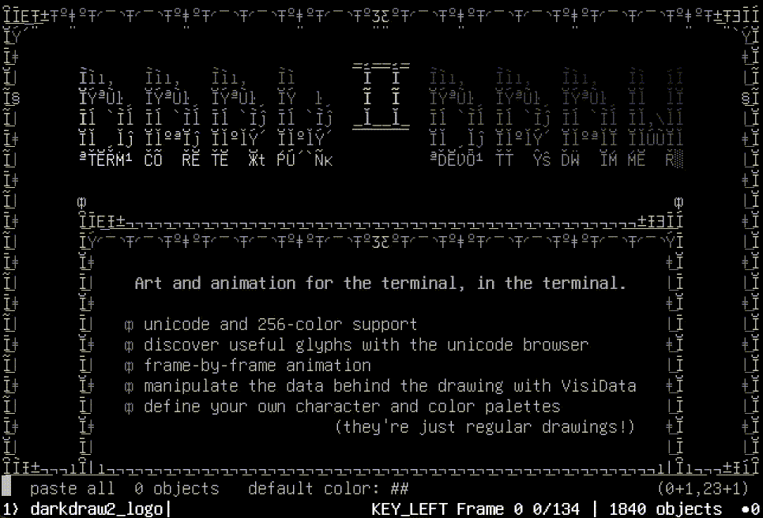
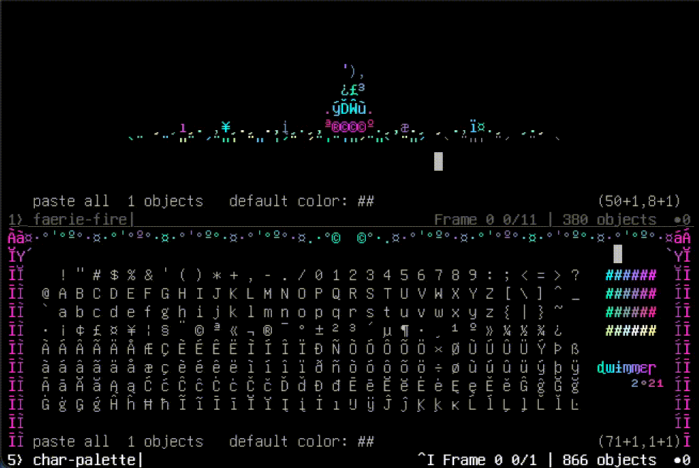

# DarkDraw II

Art and animation for the terminal, in the terminal.



- unicode and 256-color support
- discover useful glyphs with the unicode browser
- frame-by-frame animation
- manipulate the data behind the drawing with [VisiData](https://visidata.org)
- define your own character and colour palettes (they're just regular drawings)

[A brief history of the project](https://twitter.com/saulfp/status/1377747742290665475).

All art and animations in this README were created by [dwimmer](https://www.instagram.com/dwimmer.tm/) using DarkDraw.

## Platform requirements

- Linux, OS/X, or Windows (with WSL)
- [Python 3.7+](https://www.python.org/downloads/)
- [VisiData >= v3.0](https://github.com/saulpw/visidata), [requests](https://docs.python-requests.org/en/master/) and [wcwidth](https://github.com/jquast/wcwidth)
    - will be installed automatically through the installer
- [unifont](https://www.unifoundry.com/pub/unifont/) for saving to .png

## Install

DarkDraw is a plugin for [VisiData](https://github.com/saulpw/visidata). There are two ways to install it.

### Install VisiData first

0. Ensure Python3 and pip3 are installed on your system.

```
    python3 --version
    pip3 --version
```

1. Install the latest VisiData release from GitHub:

```
    pip3 install visidata
```

2. Then once installed launch VisiData:

```
    vd
```

3. Install the latest darkdraw release from GitHub:

```
    pip3 install git+https://github.com/devottys/darkdraw.git@master
```

### Use existing Dockerfile (default opens with a tutorial)

0. Clone the darkdraw directory

```
git clone https://github.com/devottys/darkdraw.git
cd darkdraw
```

1. Build the Docker image

```
docker build -t darkdraw .
```

2. Then whenever you want to run darkdraw with its tutorial

```
docker run --rm -it darkdraw
```

## Usage

Darkdraw is a VisiData plugin, to use the darkdraw loader with a new project, have VisiData open a new filetype with the suffix `*.ddw`.

```
    vd foo.ddw
```

To start, you can play with some of the samples:

```
    vd https://bluebird.sh/ddw/colors.ddw
    vd https://bluebird.sh/ddw/bouncyball.ddw
    vd https://bluebird.sh/ddw/arrows.ddw
    vd https://bluebird.sh/ddw/bw16colors.ddw
```

or with the tutorial:

```
vd https://bluebird.sh/ddw/darkdraw-tutorial.ddw
```

If pulling from the url does not work, try downloading the file, and then:

```
vd colors.ddw
vd darkdraw-tutorial.ddw
```



## Commands

- `Ctrl+S` (save-sheet): save drawing to .ddw (either from drawing or backing sheet)
- `Shift+A` (new-drawing): open blank untitled drawing

## Backing sheet

The drawing is rendered from a straightforward list of items with x/y/text/color and other attributes.
This list can be used directly and is called the 'backing sheet'.

- `` ` `` (open-source): push backing sheet (if on drawing) or drawing (if on backing sheet)

- `Enter` (dive-cursor): push backing subsheet with only rows under the cursor
  - Note: edits to rows on any backing subsheets will be applied directly, but deleting rows or adding new rows will have no effect.  Any adding, deleting, or reordering must be done from the top sheet.
- `g Enter` (dive-selected): push backing sheet with all selected rows.

### Movement

- `zh` `zj` `zk` `zl`: move the cursor to the next object in that direction.  Useful for sparse areas.
- `g` Arrow (or `gh/gj/gk/gl`): move all the way to the left/bottom/top/right of the drawing
- `PgUp` `PgDown` move the viewport up/down the Drawing; for Drawings bigger than the visible screen

### Cursor

- `Ctrl+Arrow` / `z Arrow`:  expand or contract the cursor box by one cell
- `gz Left` / `gz Up`: contract cursor to minimum width/height


### Selection

- `s` `t` `u`: select/toggle/unselect all items at cursor
- `gs` `gt` `gu`: select/toggle/unselect all items in drawing
- `zs` (select-top-cursor): select only top item at cursor

- `,` (select-equal-char): select all items with the same text as the top item at the cursor

- `{` / `}` (go-prev-selected/go-next-selected): go to prev/next selected item on drawing (same as VisiData sheets)

#### Tags

- `+` `z+` `g+` (tag): add given tag to cursor/topcursor/selected items
- `|` (select-tag): select all items with the given tag
- `\` (unselect-tag): unselect all items with the given tag

### Extra hotkeys

- `v` (): cycles through 3 "visibility modes":
  - 0: don't show extra hotkeys
  - 1: show tag hotkeys
  - 2: show clipboard hotkeys

In visibility mode 1, tags are shown on the right side.
Press the two-digit number (e.g. `01`) before the tag to hide/unhide objects in that tag.
Use `g01` to select and `z01` to unselect objects with that tag.  Press `00` to unhide all tags.

These extra hotkeys will function regardless of whether they are currently shown.

### Character positioning

- `Shift+H/J/K/L` slide the selected items one cell in the given direction
- `g Home` / `g End` send selected rows to the 'top' or 'bottom' of the drawing, by changing their position in the underlying DrawingSheet
- `i` (insert-row): insert a new line at the cursor
- `zi` (insert-col): insert a new column at the cursor

### Editing

- `a` (add-input): add text at the cursor (typing it directly)
- `e` (edit-char): change text of the top cursor item to input
- `ge` (edit-selected): change text all selected characters to input
- `d` (delete-cursor): delete all items under the cursor
- `gd` (delete-selected): delete all selected items

### Clipboard (copy/paste)

- `y` (yank-char): yank items at cursor to clipboard
- `gy` (yank-selected): yank all selected items to clipboard
- `x` (cut-char): delete all chars at cursor and move to clipboard (shortcut for `yd`)
- `zx` (cut-char-top): delete top character at cursor and move to clipboard

- `;` (cycle-paste-mode): cycle between the three paste modes:
  - **all**: the character and its color are pasted as a new item
  - **char**:  the character is pasted as a new item, with the default color (whatever color the paste item had is ignored)
  - **color**:  existing characters are recolored with the paste color

- `p` (paste-chars): paste items on clipbard at cursor according to paste mode (above)

- `zp` (paste-special):
    - if paste mode is color, paste color only over top of cursor.
    - if group is on clipboard, paste **reference** at cursor.
    - otherwise no effect

- Individual objects that were copied to the clipboard (with `gy`, for instance) are
available to be pasted onto the drawing with the number keys.  In visibility mode 2, the objects on the clipboard are shown next to a number.  Press that number key to paste that object at the cursor.


### Glyph Discovery

- `Shift+M` to open a unicode browser
   - use standard VisiData commands (`/` to search in a column, `|` to select, `"` to pull selected into their own sheet, etc)
   - `y`  (or `gy`) to copy one (or more) characters to the clipboard
   - which can then be `p`asted directly into a Drawing

### Color

- `c` (set-default-color): set default color to color of top item at cursor

- `zc` (set-color-input): set default color to input color

- `<` `>` (cycle-cursor): cycle numeric colors for items under cursor to prev/next color
- `z<` `z>` (cycle-topcursor): cycle numeric colors for top (displayed) items under cursor to prev/next color
- `g<` `g>` (cycle-selected): cycle numeric colors for selected items to prev/next color

- or, edit the color field directly on the backing sheet
   - all the standard bulk VisiData editing commands are available on the backing sheet

#### Color values

Color values are strings like `'<attr> <fgcolorname> on <bgcolorname>'`.  Any of these may be omitted; order does not matter.  `fg` and `bg`/`on` indicate whether the color is the foreground or background.

- color names can be standard terminal colors (`red` `green` `blue` `yellow` `cyan` `magenta` `white` `black`) or a number from 0-255 for [xterm 256 colors](https://jonasjacek.github.io/colors/).
- The terminal attributes `underline` and/or `bold` can be anywhere in the string.
- Omitting the fg or bg color will fall back to the default color (white for fg, black for bg) for display.

- Examples:
  - `magenta`
  - `green on black`
  - `bg cyan fg white`
  - `bold 36 on 243`
  - `on yellow underline fg 57`

### Groups

Groups are handled as a single entity, both on the drawing and on the backing sheet.

- `)` `z)` `g)`  group cursor/topcursor/selected
- `(` `z(` `g(`  degroup cursor/topcursor/selected

### Animation

If an object or group has its 'frame' attribute set, it will only be drawn in frames with that id.

- `Shift+F` (open-frames): open list of the Frames in this Drawing
- `[` (prev-frame) and `]` (next-frame): go to previous or next frame
- `g[` (first-frame) and `g]` (last-frame): go to first or last frame
- `z[` (new-frame-before) and `z]` (new-frame-after): create a new frame right before or right after the current frame

- `r` (reset-time): play all frames in animation

### VisiData commands (not specific to DarkDraw)

- `o`: open a new file (open a Drawing if extension is .ddw)

#### panes and windows

- `Shift+Z`: split window into 50% top and 50% bottom pane
- `Tab`: swap active pane
- `g Ctrl+^`: cycle through sheets in this pane

## Options

- `autosave_interval_s`: number of seconds between autosaves (default 0 is disabled)
- `autosave_path`: folder for autosave files
- `disp_guide_xy`: string of x y to draw guides onscreen (default `80 25`)

## Notes for VisiData users

- on DrawingSheet, `[` and `]` are unbound (normally sort): accidentally sorting a DrawingSheet can be disastrous, since characters are drawn in order (so later characters are 'on top')
